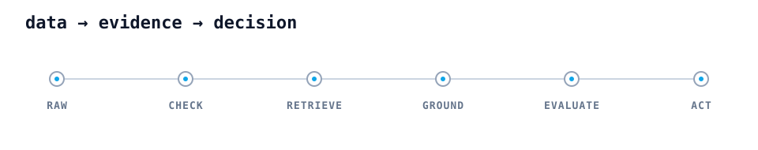

# Haipei (Jeremy) Zhong

**Data & AI engineer building systems that make evidence usable.**

Dallas–Fort Worth · CMU Heinz College  
[Email](mailto:haipeizhong@outlook.com) · [GitHub](https://github.com/Jeremyt34t34t34)

---

I work where data engineering meets applied AI: production pipelines, retrieval systems, evaluation, and the reliability layer around models.

My recurring question is simple:

> Can we trace the answer back to evidence, measure whether it is good, and see when the system fails?

## Selected systems

### [Biomedical Dataset Discovery Assistant](https://github.com/Jeremyt34t34t34/biomedical-dataset-discovery-assistant)

Evidence-aware retrieval over **70K biomedical metadata records** from GDC/TCGA and cBioPortal. The system distinguishes explicit evidence from inferred relevance and evaluates retrieval quality, negative exclusion, claim grounding, and LLM judge behavior.

`Python` · `Hybrid retrieval` · `RAG evaluation` · `Streamlit`

### [ClaimDrift](https://github.com/Jeremyt34t34t34/ClaimDrift)

A collaborative agent system for detecting how scientific claims change between preprints and peer-reviewed publications. It combines claim extraction, drift analysis, citation finding, schema gates, retries, negative controls, and memory synthesis.

`Vertex AI` · `Elasticsearch` · `MCP` · `Cloud Run` · `Pub/Sub`

### Hanshow production data workflows

Airflow-based retail IoT workflows spanning **21 divisions, 2,500+ stores, and 10,000+ ESL devices**. My work covers API and MySQL extraction, reconciliation, scheduled reporting, webhook alerts, deployment validation, and same-day issue detection.

`Python` · `SQL` · `Airflow` · `REST APIs` · `MySQL`

## Work in numbers

| Scale | What it represents |
|---:|---|
| **1M+ / day** | ETL records processed |
| **2,500+** | stores monitored |
| **70K** | biomedical metadata records unified |
| **40–60%** | reduction in manual validation |
| **Top 2%** | Kaggle finish, #202 of 11,053 teams |

<strong>How I build reliable AI systems</strong>

 

1. Make the data contract explicit.
2. Keep evidence separate from inference.
3. Evaluate retrieval before polishing generation.
4. Put schema checks, retries, and timeouts at system boundaries.
5. Make failures visible enough to debug.

## Also shipped

- **Granite Telecommunications** — 5 production tables, 26K+ records, 132 features, XGBoost, SHAP, and production-style inference.
- **Secidea** — Scrapy-Redis ETL processing 1M+ records/day with about 30% higher throughput.
- **Shoptaki** — Zillow API to PostgreSQL pipeline and a three-model ensemble reaching R² = 0.90.

## Working with

**Core:** Python, SQL, Bash, Airflow, REST APIs, PostgreSQL, MySQL  
**Data platforms:** Spark, Snowflake, Databricks  
**AI systems:** hybrid retrieval, RAG evaluation, agent workflows, claim grounding  
**Infrastructure:** GCP, Cloud Run, Pub/Sub, AWS, Docker, Linux
